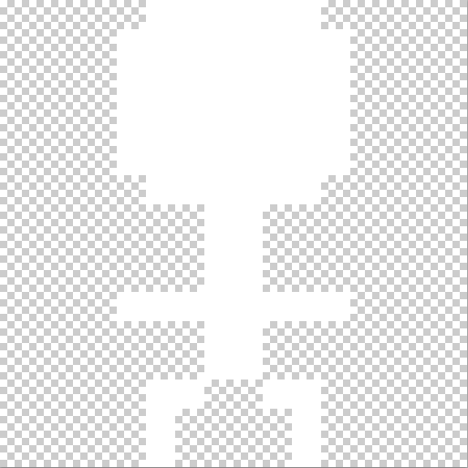
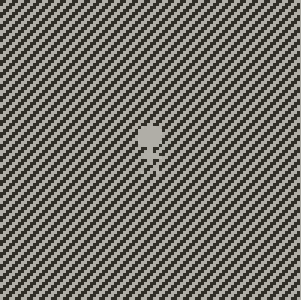
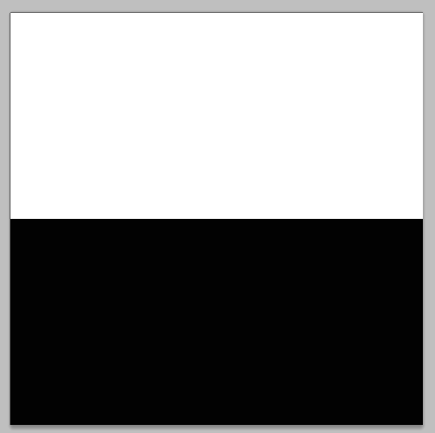
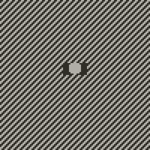
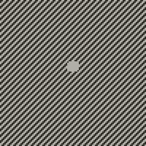
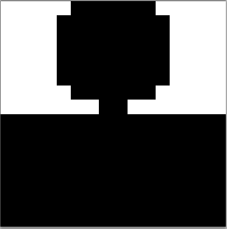
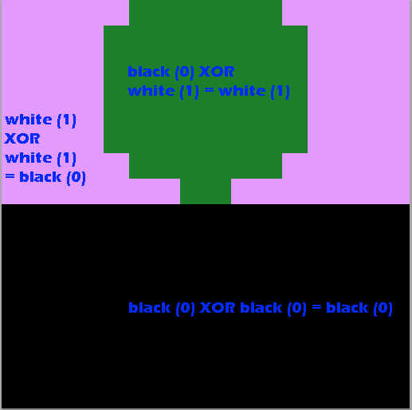
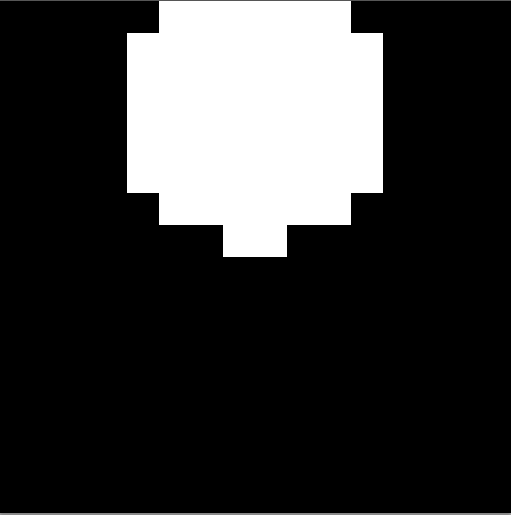

# actualMask
adds the ability to set an actual image Mask on Playdate -- works similar to masking in unity/cocos/photoshop and I guess most softwares that use masks
## installation

just copy source/actualMask.lua in your project, or the code below

```lua
function setAnActualMaskToImage(image, mask)
	local maskCopy = mask:copy()

	gfx.pushContext(maskCopy)
	gfx.setImageDrawMode(gfx.kDrawModeFillBlack)
	image:draw(0, 0)
	gfx.setImageDrawMode(gfx.kDrawModeXOR)
	mask:draw(0, 0)
	gfx.popContext()

	image:setMaskImage(maskCopy)
end
```

## problem
although playdate SDK images support image masking with the method [setMaskImage](https://sdk.play.date/inside-playdate/#m-graphics.image.setMaskImage), there seems to be a problem -- it will override the resulting masked-image with black even if the souce of the image is transparent

## solution

let's start by having a simple 16x16 stickman being drawn in front of a diagonal pattern



```lua
img = gfx.image.new('assets/images/stickman')

function playdate.update()
	gfx.setDitherPattern(.5, gfx.image.kDitherTypeDiagonalLine)
	gfx.fillRect(0, 0, 100, 100)
	img:draw(42, 42)
end
```




Simple and clean. Now Lets try to add a mask to it that will cover only the top 8 rows of the stickman -- their head. Remember that white means draw, black means do not draw.




```lua
mask = gfx.image.new('assets/images/mask')
img:setMaskImage(mask)
```



So what happened? Although the body and feet from the stickman are not drawn as expected, there is now a black background besides the head! We do not want that, since the source image did not have any pixels set there.

Why does this happen? No Idea. But thats not what I expect from masking at all, that is for sure.

Now lets use the magic function setAnActualMaskToImage

```lua
mask = gfx.image.new('assets/images/mask')
setAnActualMaskToImage(img, mask)
```



Awesome! this is how masks are supposed to work!

## how Does actualMask work?

we begin by making a copy of the original mask, add it to a context in order to draw inside it, then draw the source image on it but with kDrawModeFillBlack, this is the resulting image



next, we draw the original mask on top of the mask copy, but with kDrawModeXOR



this is the final result, that we set back as the official image mask so playdate can properly draw it


